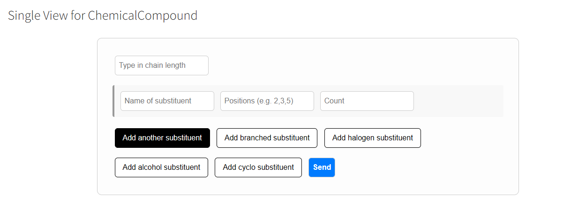
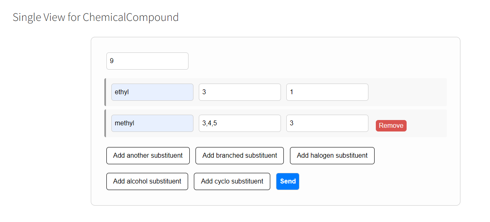
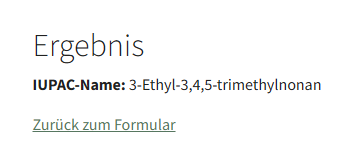
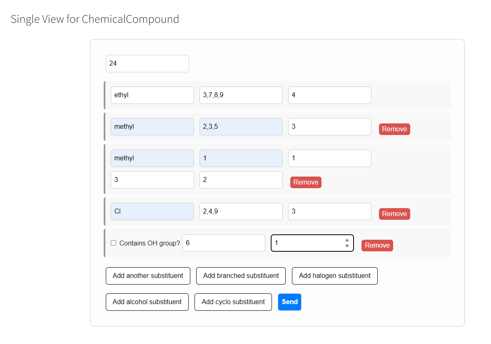
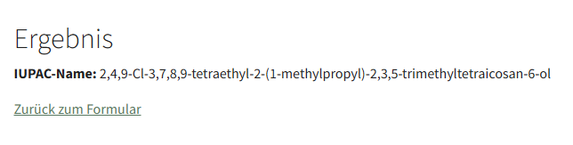
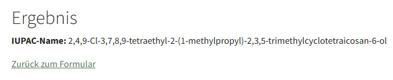

How to Use
==========

This section shows you how to use the IUPAC Nomenclature extension with detailed examples and screenshots.

Example 1: Simple Alkane Naming
===============================

This example demonstrates how to name a simple alkane using the IUPAC Nomenclature extension.

Step 1: Form Configuration
-------------------------

   This is the empty form with the placholder. The black hovered buttons shows that there are possibilities to add more substituents

Step 2: Input Parameters
-----------------------

   Enter the specific parameters. Keep in mind that at the longest chain length should at the end by adding substituents even the 
   longest chain. 
   We decided in this example with 9 Carbon atoms for the longest chain. One ethyl substituent at the position 3 and one in count at least.

Step 3: Generated Result
-----------------------

   The extension generates the correct IUPAC name: "3-Ethyl-3,4,5-trimethylnonan" for a 9-carbon alkane.

Example 2: Branched Alkane Naming
=================================

This example shows more complex alkane with substituents.

Step 1: Form Configuration
-------------------------

   Configure the form for a branched alkane. Set the longest chain length to 24 carbon atoms, 
   with 4 ethyl, 1 methyl, one branched isopropyl, three chloro and one alchol substituents as seen in the positions in the form.

Step 2: Result of non cyclic alkane
-----------------------------------

   The extension generates the correct IUPAC name: "2,4,9-Cl-3,7,8,9-tetraethyl-2-(1-methylpropyl)-2,3,5-trimethyltetraicosan-6-ol" for a 9-carbon alkane

Step 3: Generated Result for cyclic compound
--------------------------------------------

   The extension generates the correct IUPAC name: "IUPAC-Name: 2,4,9-Cl-3,7,8,9-tetraethyl-2-(1-methylpropyl)cyclotetraicosan-6-ol" for the cyclic branched alkane.

Form Configuration Details
=========================

The IUPAC Nomenclature extension provides a user-friendly form for generating chemical compound names:

#. **Longest Chain Length**: Select the number of carbon atoms in the longest chain
#. **Number of Substituents**: Choose how many substituents are attached
#. **Position of Substituents**: Specify where the substituents are located
#. **Type of Substituents**: Select the type of substituents (methyl, ethyl, etc.)

The extension will automatically generate the correct IUPAC name based on your input parameters, 
following the official IUPAC naming conventions for organic compounds. 2